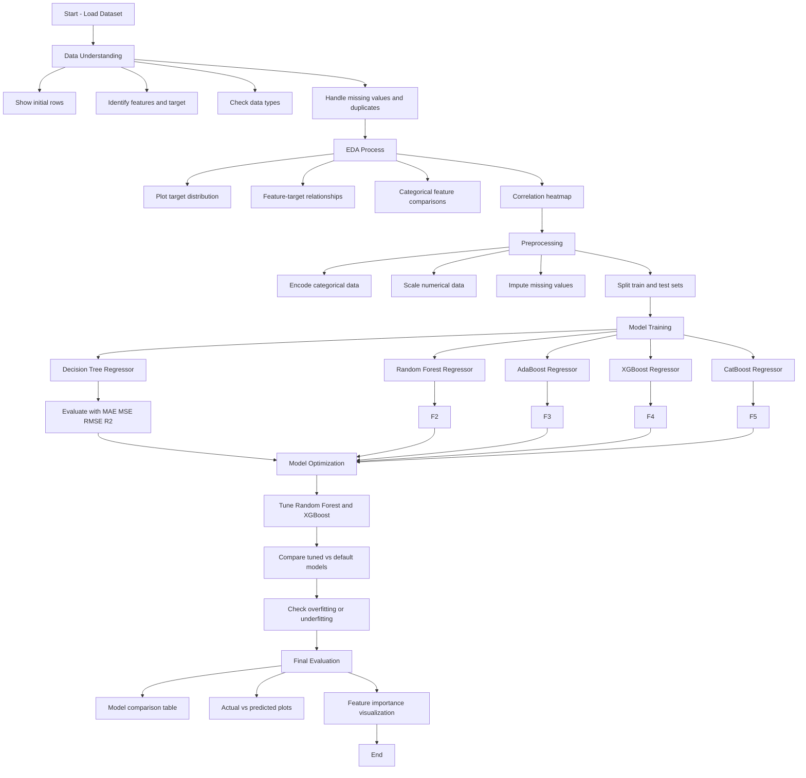

# Assignment_Regression_with_Machine_Learning_Regressors

```mermaid
flowchart TD
    A[Start - Load Dataset] --> B[Data Understanding]
    B --> B1[Show initial rows]
    B --> B2[Identify features and target]
    B --> B3[Check data types]
    B --> B4[Handle missing values and duplicates]

    B4 --> C[EDA Process]
    C --> C1[Plot target distribution]
    C --> C2[Feature-target relationships]
    C --> C3[Categorical feature comparisons]
    C --> C4[Correlation heatmap]

    C4 --> D[Preprocessing]
    D --> D1[Encode categorical data]
    D --> D2[Scale numerical data]
    D --> D3[Impute missing values]
    D --> D4[Split train and test sets]

    D4 --> E[Model Training]
    E --> E1[Decision Tree Regressor]
    E --> E2[Random Forest Regressor]
    E --> E3[AdaBoost Regressor]
    E --> E4[XGBoost Regressor]
    E --> E5[CatBoost Regressor]

    E1 --> F1[Evaluate with MAE MSE RMSE R2]
    E2 --> F2
    E3 --> F3
    E4 --> F4
    E5 --> F5

    F1 --> G[Model Optimization]
    F2 --> G
    F3 --> G
    F4 --> G
    F5 --> G

    G --> G1[Tune Random Forest and XGBoost]
    G1 --> G2[Compare tuned vs default models]
    G2 --> G3[Check overfitting or underfitting]

    G3 --> H[Final Evaluation]
    H --> H1[Model comparison table]
    H --> H2[Actual vs predicted plots]
    H --> H3[Feature importance visualization]

    H3 --> I[End]

```
